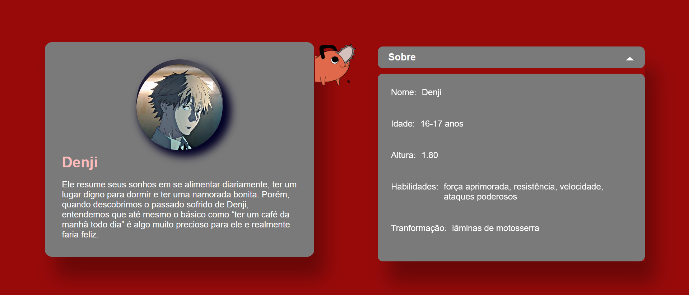

  <h1 >🪚 CardAnimation - Chainsaw Man Anime Information</h1>

 

  

## Tecnologias Utilizadas

- Next.js
- TypeScript
- Styled Components
- Framer Motion

## Visão Geral

O projeto "CardAnimation" é uma demonstração do poder das tecnologias Next.js, TypeScript, Styled Components e Framer Motion ao criar animações fluidas e responsivas para exibir informações sobre personagens do anime "Chainsaw Man". A aplicação fornece uma interface amigável e atraente que apresenta as informações de forma interativa.

## Instalação

Para executar localmente o projeto, siga os passos abaixo:

1. Certifique-se de ter o Node.js instalado em seu sistema.
2. Clone este repositório em sua máquina local.
3. Acesse a pasta do projeto via terminal.
4. Instale as dependências do projeto com o seguinte comando:
   `npm install`
5. Após a instalação, execute o projeto com o comando:
   `npm run dev`
6. Acesse a aplicação em seu navegador através do endereço [http://localhost:3000](http://localhost:3000).

## Funcionalidades Principais

- Exibição de informações detalhadas sobre os personagens do anime "Chainsaw Man".
- Animações suaves e responsivas que proporcionam uma experiência agradável aos usuários.
- Interface intuitiva e de fácil utilização.
