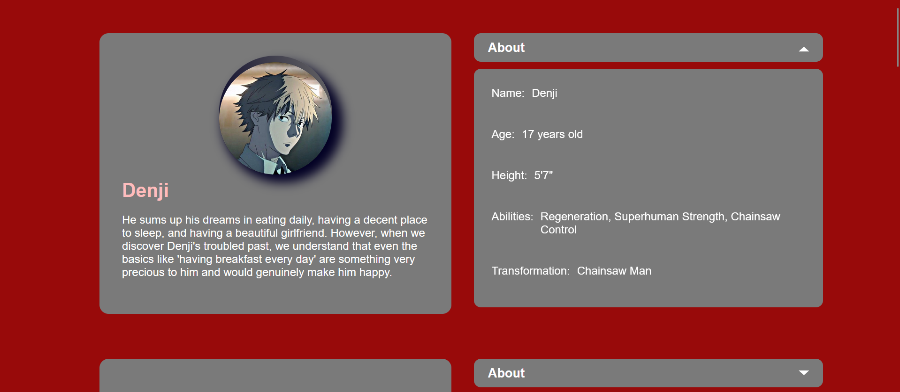

  <h1 >🪚 CardAnimation - Chainsaw Man Anime Information</h1>

 

  

## Tecnologies

- Next.js
- TypeScript
- Styled Components
- Framer Motion

## Overview

The "CardAnimation" project is a demonstration of the power of Next.js, TypeScript, Styled Components, and Framer Motion technologies in creating smooth and responsive animations to display information about characters from the anime "Chainsaw Man." The application provides a user-friendly and visually appealing interface that presents the information interactively.

## Installation

To run the project locally, follow the steps below:

1. Make sure you have Node.js installed on your system.

2. Clone this repository to your local machine.

3. Access the project folder via the terminal.

4. Install project dependencies with the following command:

   `yarn install`

5. After the installation, run the project with the command:

   `yarn run dev`

6. Access the application in your browser through the following address http://localhost:3000.

## Key Features

- Display detailed information about characters from the anime "Chainsaw Man."
- Smooth and responsive animations that provide an enjoyable user experience.
- Intuitive and easy-to-use interface.
